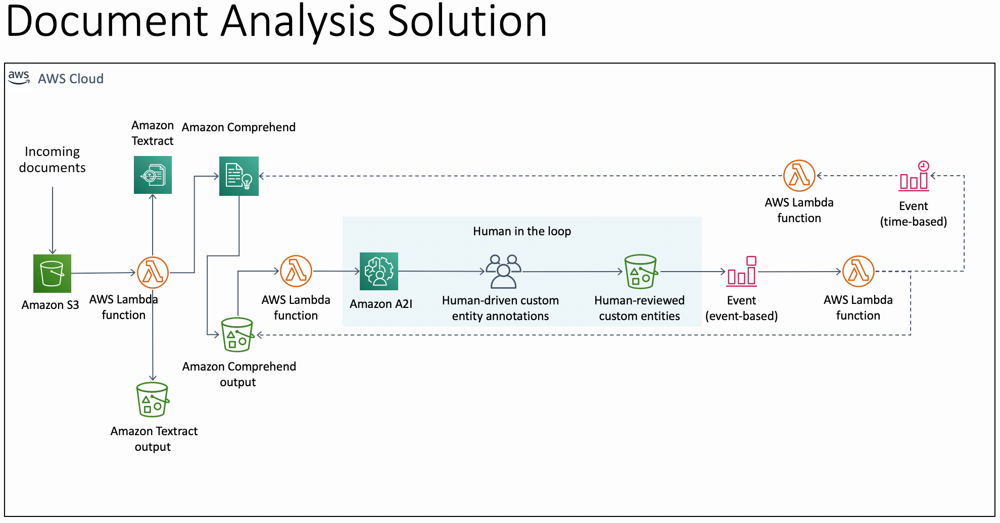

# Intelligent Document Processing using Amazon Textract, Amazon Comprehend and Amazon A2I

### As presented in the AWS ML Summit June 2021

We modified the existing Document Analysis solution for the processing of financial forms, such as a loan application. The solution shows how you
can setup a workflow to receive a loan application, extract the text using Amazon Textract, review the contents using Amazon Comprehend Custom Entity Recognition, decide if its a Genuine request using Amazon A2I and provide feedback to retrain the Amazon Comprehend model.

Please refer to the ML Summit video for a walkthrough and demonstration.

## Solution Architecture

## Setup Resources
In order to setup the required resources for this solution, you need to execute the Cloudformation Template that is provided with the solution. Once you have completed the prerequisites listed below, you should be able to deploy the Cloudformation Template in your account.

### Prerequisites

There are a few prerequisite steps that you need to perform before you can deploy this solution to your AWS account and here are the steps to do them:

#### Create your S3 bucket

  1. First clone this git repo locally in your computer by typing "git clone https://github.com/aws-samples/amazon-textract-comprehend-a2i"
  2. Navigate to the ml-summit-2021 folder
  3. Now create a S3 bucket called as **S3BucketNamePlaceholder** in your AWS account
  4. Create a prefix "intelligent-doc-demo/comprehend_data" in the S3 bucket you created and upload the "entitylist.csv" and "raw_txt.csv" from the local "comprehend_data" folder
  5. Create a prefix "code/lambda_handlers" in the S3 bucket and upload all the zip files from the local "code/lambda_handlers" folder
  6. Create a prefix "intelligent-doc-demo/a2i-output" in the S3 bucket. We will refer to this in the steps below.
  7. Upload the CloudFormation template "Textract-Comprehend-A2I.yaml" to the "code" prefix in your S3 bucket   

####  Create a Human Review Workflow

* Create a [private workforce](https://docs.aws.amazon.com/sagemaker/latest/dg/sms-workforce-management-private-console.html) from the Amazon SageMaker console.

* Create a [Custom Worker Template](https://docs.aws.amazon.com/sagemaker/latest/dg/a2i-create-worker-template-console.html) from Amazon Augmented AI console. Use the file **ml-summit-2021/ui/task_template.html** as the custom template. Remember to choose the "Custom" option when creating the template.

* Create a [Flow Definition](https://docs.aws.amazon.com/sagemaker/latest/dg/a2i-create-flow-definition.html#a2i-create-human-review-console) from the Amazon Augmented AI console.
    1. Use "**S3BucketNamePlaceholder/intelligent-doc-demo/a2i-output**" for S3 Bucket.
    2. For IAM role, choose 'Create a new role' and ensure you select "Any S3 bucket".
    3. For Task Type, choose 'Custom'
    4. For Template, choose the custom worker template you created above.
    5. For Worker Types, choose 'Private'.
    6. For Private Teams, choose the team you created above.
    7. After creation, copy the **Flow Definition ARN**. We will use it later.

#### Train the Comprehend Custom Entity Model

* Go to Amazon Comprehend and [train a custom entity recognizer](https://aws.amazon.com/blogs/machine-learning/build-a-custom-entity-recognizer-using-amazon-comprehend/)
using the files you just copied in **comprehend_data** folder.

### Parameters

There are several parameters that you would need to deploy the CloudFormation template to your account. This section lists those parameters so that you understand them and get prepared for deploying the CloudFormation Template.

#### S3BucketName:
Description: Enter the name for an input S3 Bucket to be created for you.

#### S3OutBucketName:
Description: Enter the name for an output S3 Bucket to be created for you.

#### FlowDefinitionARN:
Description: Enter the Human Review Workflow ARN that you have defined.

#### CustomEntityRecognizerARN:
Description: Enter the Custom Entity Model ARN that is currently in use.

#### CustomEntityTrainingListS3URI:
Description: Enter the S3 URI for the file that contains entities for the Amazon Comprehend custom entity recognizer training.

#### CustomEntityTrainingDatasetS3URI:
Description: Enter the S3 URI for the file that contains training dataset for the Amazon Comprehend custom entity recognizer training.

### Package and Deploy the CloudFormation Template

#### Deploy the CloudFormation Template

  1. Go to the S3 console, open the S3 bucket you created in step 1 of the prerequisites, go to "code" prefix within the bucket, click on the name of the CloudFormation template "Textract-Comprehend-A2I.yaml" and copy the **Object URL**

  2. Type "CloudFormation" in the Services search window in the AWS Console, and click on Create Stack (with new resources), choose "Template is Ready", and "Amazon S3 URL" as the Template Source, and in the Amazon S3 URL, paste the Object URL you copied in the step above.

  3. Provide the values for various parameters as explained above, click Next, review, select "agree", and create the stack  

## Test the Deployment

  1. Once the stack is successfully created, go to the input S3 Bucket, "S3BucketName" that you specified at stack creation. Create a new folder titled **intelligent-doc-demo/input**.
  2. Upload the "borrower_sample.png" from your local "ml_summit_2021/input" folder. The workflow begins with this step.
  3. Check for the appearance of the "intelligent-doc-demo/cer-input" and "intelligent-doc-demo/cer-output" folders in the input S3 bucket. This indicates the completion of Textract extraction and  Comprehend identifying the custom entities from the input loan form.
  4. Click the private worker URL from Amazon SageMaker --> Labeling Workforces --> Private
  5. Login to the Worker Task UI, select the input text from the document and re-label them as required, click Submit when finished.
  6. Now go to the original S3 bucket you created in Step 1 of the Prerequisites, navigate to "comprehend_data". You should see an "updated_entitylist.csv" file. Review the contents of this file.

**Please go through the ML Summit <video> for the full walkthrough of the steps.**

## Results

At the end of each day, a Cloudwatch Event invokes a Lambda function automatically that looks for any new custom entities that the human reviewers may have identified using the Amazon A2I worker portal. If there are any entities that did not exist in the entity list file that was used to train the model, then it retrains the Amazon Comprehend Custom Entity model and uses the new model for inference thereafter.

This automated retraining process, allows the model to improve perpetually and requires lesser human intervention over time, hence saving time and cost for your business.

## Security

See [CONTRIBUTING](CONTRIBUTING.md#security-issue-notifications) for more information.

## License

This library is licensed under the MIT-0 License. See the LICENSE file.
